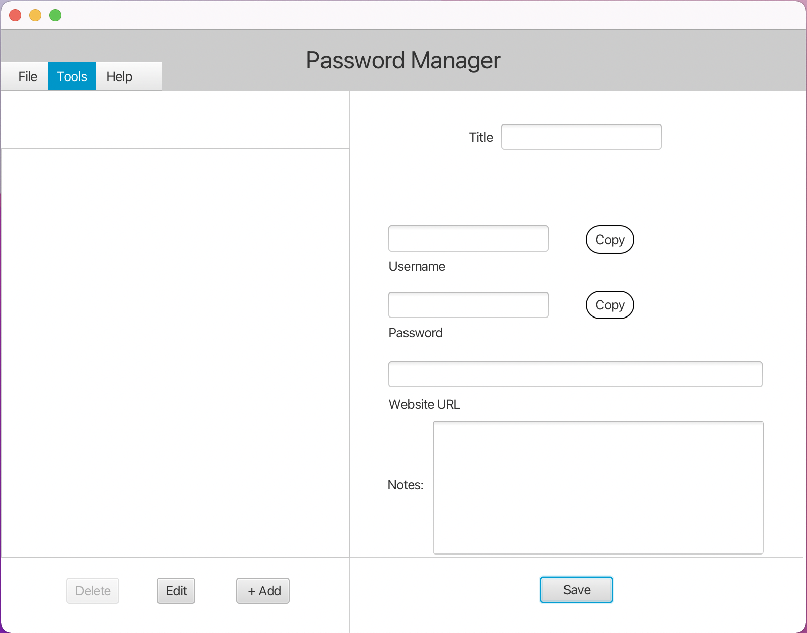
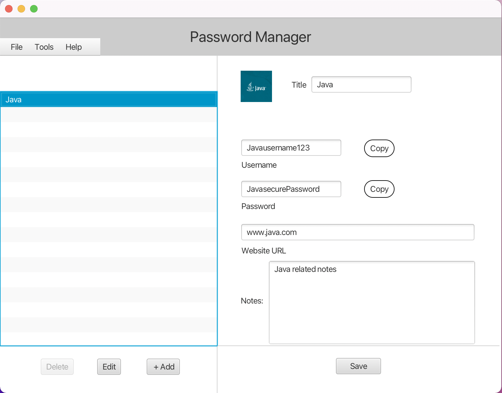

# Java-Password-Manager

## Developed with JavaFX and Scenebuilder.
Note (This password manage does not use encryption for username or password fields. it is stored as plain text in JSON file.)
### Features
- Textfield complete (username/password)
- Create/Delete operations
- Saves to Local JSON file
- Detects if JSON file exists else creates empty one
- Uses clearbitlogo https://clearbit.com/logo API to load website icons ex: https://logo.clearbit.com/apple.com

### Example Clearbitlogo use
```
  private Image image;
  private static String imgurl = "https://logo.clearbit.com/";
  
  image = new Image(imgurl + lbltitle.getText() + ".com"); 
		  		  
	if(image.isError()) 
  	{
	image = new Image(imgdefault);
	iconimage.setImage(image);
	}
  	else{
	iconimage.setImage(image);
	//System.out.println("image successfully loaded from " + image.getUrl());
  	}

```
## Main screen


## Logo imported



## About/Version


## Password Generator


### TODO's
- Enable user to select JSON file from file system
- Drag and drop file loading
- Link/create random password
- Encryption Salt/Hash
